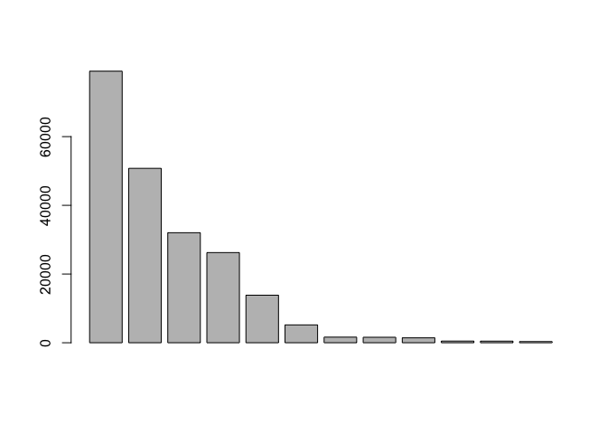

class05
================
Luan Tran
6/4/2019

``` r
# Class 5 R Graphics

# 2A. Line
weight <- read.table("bimm143_05_rstats/weight_chart.txt", header = TRUE)

plot( weight$Age, weight$Weight, xlab="Age (months)", 
      ylab="Weight (kg)", pch=18,
      typ="b",
      main="Some Title")
```

<!-- -->

``` r
# 2B 
feat <- read.table("bimm143_05_rstats/feature_counts.txt", sep="\t", 
           header = TRUE)
barplot(feat$Count)
```

<!-- -->

``` r
# I need to argue with this plot to make it a bit nicer.
par(mar=c(3,15,4,2))
barplot(feat$Count, names.arg = feat$Feature, horiz = TRUE,
        las=1, ylab = "A Title", main = "Some title")
```

<!-- -->

``` r
# 3A
counts <- read.table("bimm143_05_rstats/male_female_counts.txt", header = TRUE, sep="\t")
counts <- read.delim("bimm143_05_rstats/male_female_counts.txt")
barplot(counts$Count, names.arg = counts$Sample, las=2,
        col=c("red","blue","green") )
```

<!-- -->

``` r
barplot(counts$Count, names.arg = counts$Sample, las=2,
        col=c(1,2))
```

<!-- -->
